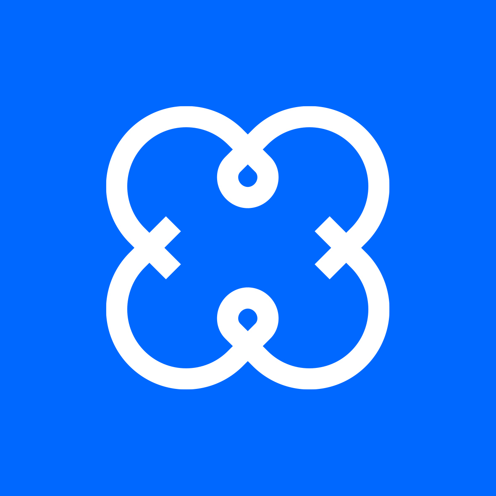

 

  

  <h3 align="center">프렌클리</h3>

## Android Software Enginner

프렌클리는 전세계의 teenager들에게 좀 더 나은 소셜공간을 제공한다는 비전으로 시작한 스타트업입니다.
Z세대에 최적화된 새로운 소셜영역을 만들어내고자 이들에게 fit하고 fun한 기능들을 기획하였고
새로운 기술을 연구 및 적용하여 세상에 없던 새로운 소셜플랫폼 ‘마카마카’를 개발하고 있습니다.

창업멤버 외 팀원들 모두 기술 백그라운드가 강하며 그 어느곳에 가더라도 탑클래스로 인정받을 엔지니어들과 글로벌 대규모 트래픽 서비스를 다수 경험한 백그라운드가 있는 멤버들이 다수 포진되어 있습니다.
또한 창업멤버들의 성공적인 연쇄창업 및 성공경험이 회사의 빠른 성장과 성공을 일궈낼수 있으리라 자부하며 이는 멤버 개개인의 성장에 도움을 드릴 수 있는 최고의 환경이라 생각합니다.

---

### 주요업무

- Kotlin으로 마카마카 서비스 안드로이드 앱 개발
- 마카마카 서비스 안드로이드 앱 유지보수
- 보다 나은 UX를 위한 성능 개선
- 보다 나은 개발/빌드/배포 환경을 위한 개선
- 개발 초기의 서비스를 더 좋은 방향으로 갈 수 있게 하는 논의

### 자격요건

- 전산 관련 전공 혹은 그에 준하는 지식
- 3년 이상의 안드로이드 앱 개발 경험
- 2년 이상의 kotlin 개발 경험
- 안드로이드 아키텍쳐에 대한 이해
- git을 통한 협업 경험
- 협업툴(slack, google workspace)을 통한 업무 및 커뮤니케이션 경험
- 자기 주도적 업무 진행

### 우대사항

- RxJava / RxKotlin / RxAndroid 개발 경험
- kotlin coroutine 개발 경험
- 실시간 채팅 관련 어플리케이션 개발 경험
- 지도 관련 어플리케이션 개발 경험
- 3rd party 서비스 연동 경험
- 플레이스토어 서비스 런칭 경험
- 테스트/배포 자동화 환경 경험
- 트러블 슈팅 경험
- 문제 해결 능력
- 퍼포먼스 분석 및 최적화 경험
- MVC,MVP,MVVM에 대한 이해
- Figma 사용 경험

### 회사생활

- 점심과 저녁 식대 제공
- 커피, 음료 및 기타 간식 제공
- 맥북 프로 및 32인치 모니터 2대, 주변 장비 지원
- 다양한 복지와 문화는 꾸준히 개선될 예정입니다.

### 채용절차

일반적으로 ‘서류제출 - 대면 인터뷰’ 순서로 진행되며 상황에 따라 절차는 유동적으로 조정될 수 있습니다.

- 1차: 서류 제출 (이력서 필수 / github 계정 있으면 포함)
- 2차: 서면검토 및 기술인터뷰 진행

recruit@frienkly.me
